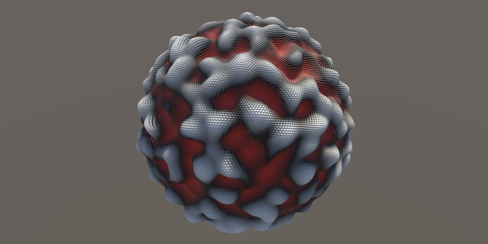

# Unity Official

## How to optimize game performance with Camera usage

[How to optimize game performance with Camera usage | Unity Blog](https://blog.unity.com/games/optimize-game-performance-with-camera-usage)

- [AccelerateSolutions Gameチーム](https://unity.com/solutions/accelerate-solutions-games)におけるプロジェクトレビューで頻繁に最適ではないカメラ設定がパフォーマンス低下の原因になるケースが多いため、[カメラの最適化についての電子書籍のパート1](https://create.unity3d.com/accelerate-success-camera-usage-ebook)を公開しています。この記事はそれをウェブにまとめたものになります。

- カメラが配置されるとUnityエンジン内でどのようなことが行われるかについて説明しています。カリングにより実際にGPUで描画されるレンダラーが絞り込まれること、マテリアルのアルファ値などで描画順序が決定されること、それらをもとに、表示されているレンダラーごとに描画コマンドを生成して、GPUに作業を送信することについて触れられています。
- カメラのコストを測定するためにテストシーンを用意しています。このシーンは[Githubにて公開されています](https://github.com/Unity-Technologies/sol-games-unity-samples)。
- テストする対象のレンダリングパイプラインは、ビルトインパイプラインとURPとしています。URPはカメラスタックを導入しています（詳細は[Manager.cs](https://github.com/Unity-Technologies/sol-games-unity-samples/blob/main/Graphics/CameraPerformance/CameraPerformance-URP/Assets/Scripts/Manager.cs)に参照とのことです）。
- テストにはUnity2020.3.11f1およびil2cppの開発ビルドを利用し、またそれぞれのパイプラインごとにデバイスごとに16のプロファイラーキャプチャーについて低負荷係数と高負荷係数の両方でテストを行っています。[Profiler Analyzer Package](https://docs.unity3d.com/Packages/com.unity.performance.profile-analyzer@1.0/manual/index.html)を用いて300フレームのキャプチャにおけるメインスレッドのプロファイラーマーカーの平均値を計算してします。また使用されるデバイスは下記としています。
    - Google Nexus 5
    - Samsung Galaxy S7 edge (G935F)
    - Samsung Galaxy A20e
    - iPhone 5s
    - iPhone 7
- サーマルスロットリングが発生するとパフォーマンスを確実に計測できないため、常に端末を冷やしながら計測しているとのことです。

## バージョン管理システムを選ぶときに考慮すべき 8 つのポイント

[バージョン管理システムを選ぶときに考慮すべき 8 つのポイント | Unity Blog](https://blog.unity.com/ja/technology/eight-factors-to-consider-when-choosing-a-version-control-system)

- バージョン管理システムを選定する際に考慮すべきポイントを、「チーム」・「ファイルの種類とサイズ」・「セットアップとメンテナンスの容易さ」・「チームのワークフロー」・「チームのシステム導入のタイミング」・「どこに費用をかけるか」・「セキュリティ要件」・「柔軟さのレベル」の8つの観点で説明しています。
- また、主要なバージョン管理システムを4つ上げ、それぞれの特徴についても解説しています。

## Unity 2020 LTS / Unity 2021.1におけるUnity Editorの小さな機能改善集

[Unity 2020 LTS / Unity 2021.1におけるUnity Editorの小さな機能改善集 | Unity for Pro](https://forpro.unity3d.jp/unity_pro_tips/2021/09/24/2509/)

- Unity 2020 LTS / 2021.1で追加・改善されたエディターの機能について紹介しています。
- Unity 2020 LTS
    - 配列型・List<T>型が、インスペクター上で並び替え可能に
    - 最近開いたSceneにメニューから素早くアクセスできるように
    - Project Window上のリネームと移動がUndo/Redoできるように
    - インスペクター上のフィールドがコピー&ペーストできるように
    - TransformコンポーネントのPopup Menuから位置、回転、大きさのコピーが可能に
    - Cut機能とPaste As a Child機能がHierarchy Windowに追加
    - 「Create Empty Parent」というContext MenuがHierarchy Windowに追加
    - GameObject生成時の親GameObject指定が可能に
    - GameObjectを生成する座標を原点とする設定が追加
    - コピー時の命名規則を設定できるように
    - Scene Viewに対して複数のオブジェクトを同時にドラッグ&ドロップ可能に
    - 現在選択中のGameObjectの数がインスペクターで表示されるように
    - Scripting Define Symbolsの項目がリストに
    - Scene Viewのカメラ設定のコピー&ペーストが可能に
    - キーボードのショートカットに「Camera」の設定項目が追加
    - Console Windowで複数行を選択可能に
    - Scene Viewの移動・回転・拡大縮小のハンドルの線が太くなり、太さも設定可能に
    - UnityEventにリスナーとしてstaticメソッドも登録できるように
- Unity 2021.1
    - Console Windowにおいて、Clear on Recompileという項目が追加
    - 配列・List<T>のインスペクターにおいて、要素を複数選択できるように
    - Gizmoのドロップダウンに検索フィルタ機能が追加
    - TransformコンポーネントのContext Menuのレイアウト配置改善
    - タブのヘッダーをクリックすることで、最大化可能に
    - ファイル移動時に移動先に同一ファイル名がある場合、確認UIを表示するように
    - 配列・List<T>の要素を削除した際の挙動の変更
- それぞれ機能紹介と追加されたバージョン、リリースノートの引用がされています。

# Article

## 【Unity】asmref（asmdefではない）を使うとinternalアクセスできて便利【Assembly Definition Reference Files】

[【Unity】asmref（asmdefではない）を使うとinternalアクセスできて便利【Assembly Definition Reference Files】 - Qiita](https://qiita.com/su10/items/7773715c8e43058e533c)

- この記事ではUnity 2019.2.0で追加されたAssembly Reference Files（`.asmref`）について紹介しています。
- asmrefを用いることで既存のアセンブリ定義ファイル（`*.asmdef`）にソースコードを追加することができる点とasmrefの作成方法、利用例としてUniRxをPackage Managerから追加しつつ`Observable.Using`のような独自の処理を追加する例と`UnityEditor.UI`のinternalなクラスにアクセスできる点について解説しています。

## Simplex Noise

[Simplex Noise](https://catlikecoding.com/unity/tutorials/pseudorandom-noise/simplex-noise/)

- この記事はCatlike Codingさんの[Pseudorandom Noise](https://catlikecoding.com/unity/tutorials/pseudorandom-noise/)シリーズの第7段です。
- Simplex Noiseアルゴリズムをベクトル化したバージョンのサポートを追加します。

## ShaderQuest Part 6: Shaping functions

[ShaderQuest Part 6: Shaping functions – Harry Alisavakis](https://halisavakis.com/shaderquest-part-6-shaping-functions/)

- この記事は[Harry Alisavakis](https://twitter.com/HarryAlisavakis)さんによる[ShaderQuest](https://halisavakis.com/category/shaderquest/)シリーズの第6段です。今回はShaping Functionについて取り上げています。
- stepやsmoothstep、lerpやinverse lerp、sineやcosine、fracなどの関数がどのような変換を行うのかを可視化しながらその動作を解説しています。

## Performance Testing Extensionを用いてUnityで実機でパフォーマンス計測をおこなう

[Performance Testing Extensionを用いてUnityで実機でパフォーマンス計測をおこなう | Yucchiy's Note](https://blog.yucchiy.com/2021/09/unity-performance-testing/)

この記事では、[Performance Testing Extension for Unity Test Framework](https://docs.unity.cn/Packages/com.unity.test-framework.performance@2.8/manual/index.html)と[Unity Test Runner](https://blog.yucchiy.com/2021/09/unity-performance-testing/)を用いて、iOSやAndroidなどの実機上でパフォーマンス計測を行う方法を紹介しています。

## Unity WebGL Secrets. or Tricks and Tips for Unity WebGL and…

[Unity WebGL Secrets. or Tricks and Tips for Unity WebGL and… | by Oren De-Panther Weizman | Sep, 2021 | Medium](https://medium.com/@depanther/unity-webgl-secrets-b6ddf214f1fd)

- この記事ではUnity WebGLが、どのようにビルドされ動作するか紹介しています。
- Unity WebGLがemscriptenやSDL、WebAssemblyを用いてどのようにビルドされているのか、`.jslib`や`.jspre`の説明、C#のメソッドをJavaScriptからどのように呼び出しているのか、WebGLデバッグの有効化方法についてそれぞれ解説しています。
