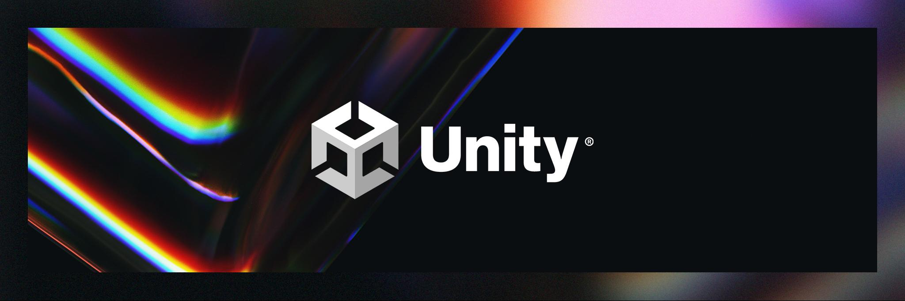
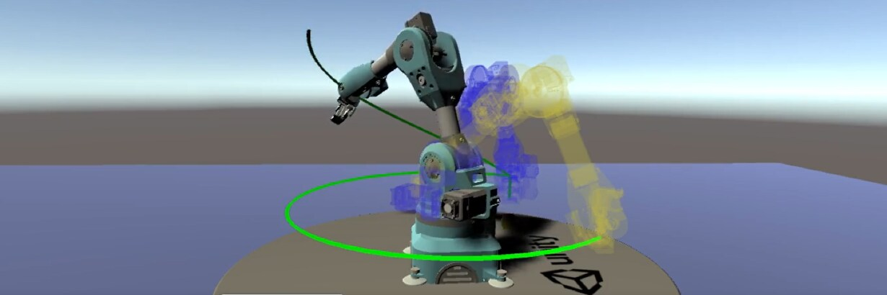
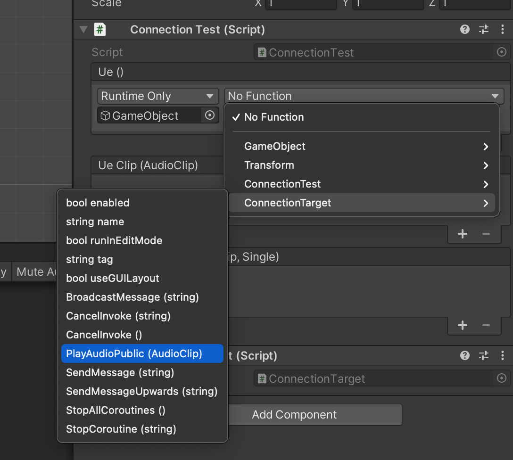
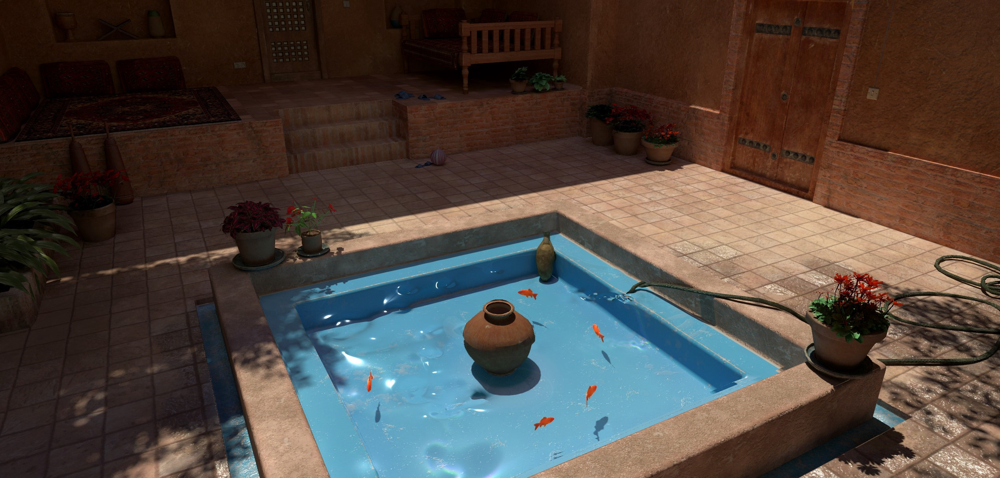
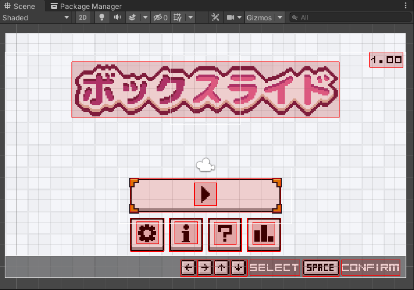

# Unity Official

## 進化を続けるブランド：新しいロゴとプロダクトアイデンティティシステムのご紹介



[進化を続けるブランド：新しいロゴとプロダクトアイデンティティシステムのご紹介 | Unity Blog](https://blog.unity.com/ja/news/say-hello-to-our-new-logo-and-product-identity-system)
[Unityのブランドデザインを一新しました｜Unity Japan（ユニティ・テクノロジーズ・ジャパン）｜note](https://note.com/unityjapan/n/n6b3b6c1f52f4)

Unityのロゴが刷新され、ロゴの２大要素であるUnityキューブと、ワードマークのデザインが一新されました。

この記事ではUnityのロゴに込められた思いと、Unity製品の新しいアニメーション化された3Dロゴについて紹介しています。


## Unity Robotics Visualizations Package のご紹介



[Unity Robotics Visualizations Package のご紹介 | Unity Blog](https://blog.unity.com/ja/manufacturing/introducing-unity-robotics-visualizations-package)

[Unity Robotics Visualizations Package](https://github.com/Unity-Technologies/Unity-Robotics-Hub)を用いることで、ROSの一般的なメッセージタイプに対応したビジュアライゼーションを行えるようです。

トランスフォームやロボットの地図構築のビジュアライゼーション、ユーザー定義のビジュアライゼーションをサポートについて紹介しています。


# Articles

## Dynamic flowing foam in Unity


[Dynamic flowing foam in Unity. In this article, I’ll explain how to… | by José Pizarro | Sep, 2021 | Medium](https://medium.com/@jmprocco/dynamic-flowing-foam-in-unity-11811775043e)

この記事では動的なフローシステムをURPでの実装を紹介しています。実装自体は[SIGGRAPHのこちらのプレゼン](https://dl.acm.org/doi/10.1145/3214745.3214820)を参考にしているようです。

URPのRenderFeatureによりパスを拡張する形で実装が行われています。3D空間（実装の場合は深度差（depth difference））をクリップスペース上に投影して計算されます。

前のフロー状態と現在の状態を２枚のレンダーテクスチャによるダブルバッファリングで保持し、そのバッファを利用してコンピュートシェーダーで計算されています。

実装は[Github](https://github.com/JoseMiguelPizarro/DynamicFlowingFoam)にて公開されています。

## UnityEvent Serialization Research



[UnityEvent Serialization Research](https://gametorrahod.com/unityevent-serialization-research/)

この記事では、`UnityEvent`のシリアライズの内部仕様について調査しています。

`UnityEvent`が内部的にどのようなデータフォーマットでシリアライズが行われているか、イベントとして指定したメソッドをリファクタリング（リネーム）した場合に壊れるのかどうか、
指定するメソッドに`public`以外でも指定できるのかどうか、メソッドの引数のシリアライズの挙動について、戻り地の扱いなどについて実験的に調査しています。


## Gentle Introduction to Realtime Fluid Simulation for Programmers and Technical Artists



[Gentle Introduction to Realtime Fluid Simulation for Programmers and Technical Artists | by Shahriar Shahrabi | Oct, 2021 | Medium](https://shahriyarshahrabi.medium.com/gentle-introduction-to-fluid-simulation-for-programmers-and-technical-artists-7c0045c40bac)

リアルタイムな流体シミュレーションについてのイントロダクション記事です。

はじめに流体シミュレーションを直感的に理解するためのナイーブな実装を説明しています。

そのあとナイーブな実装の欠陥と、それを修正するためのアイデアとしてNavier-Stokes方程式を用いたソルバーの実装を解説しています。

Unityでコンピュートシェーダーを用いた実装が[Github](https://github.com/IRCSS/Compute-Shaders-Fluid-Dynamic-)で公開されています。


## Shader Tutorial: Self-Drawing Lines


[Shader Tutorial: Self-Drawing Lines | Team Dogpit on Patreon](https://www.patreon.com/posts/56602776)

この記事では、Self-Drawing linesと呼ばれる効果を実装する方法について解説しています。

「画像のどの領域がいつ頃描画されるか」という情報を保持したマスク画像を用意しておいて、

```
half progress = saturate(
    smoothstep(mask.r - _Falloff, mask.r + _Falloff, _Line)
);
```

というような形でマスクを取って、実際の画像の輝度値としているようです。（ `_Line` が時間経過を表す変数で 0 ~ 1、 `mask.r` がマスク画像の輝度値となります）


## 【Unity】キャンバス内のオブジェクトを四角形で可視化できる「Unity Canvas Visualizer」紹介



[【Unity】キャンバス内のオブジェクトを四角形で可視化できる「Unity Canvas Visualizer」紹介 - コガネブログ](https://baba-s.hatenablog.com/entry/2021/10/06/090000)

この記事では、Unity UIのCanvas内のオブジェクト（RectTransform）をシーンビューのギズモで可視化する「Unity Canvas Visualizer」について紹介しています。

「Unity Canvas Visualizer」は、Canvasがアタッチされたゲームオブジェクトに`Canvas Visualizer`コンポーネントをアタッチすることで、子要素の`RectTransform`を可視化するようです。

