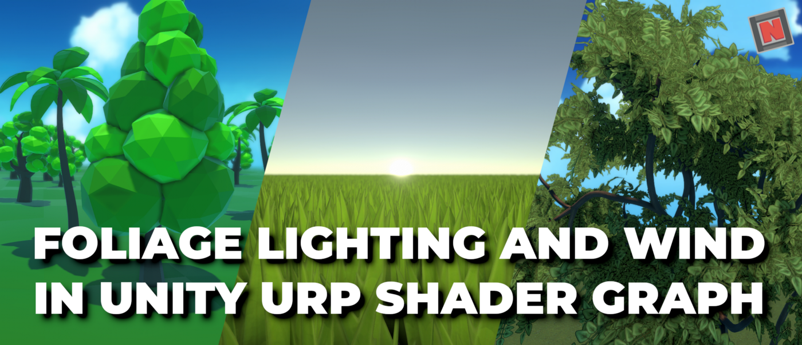
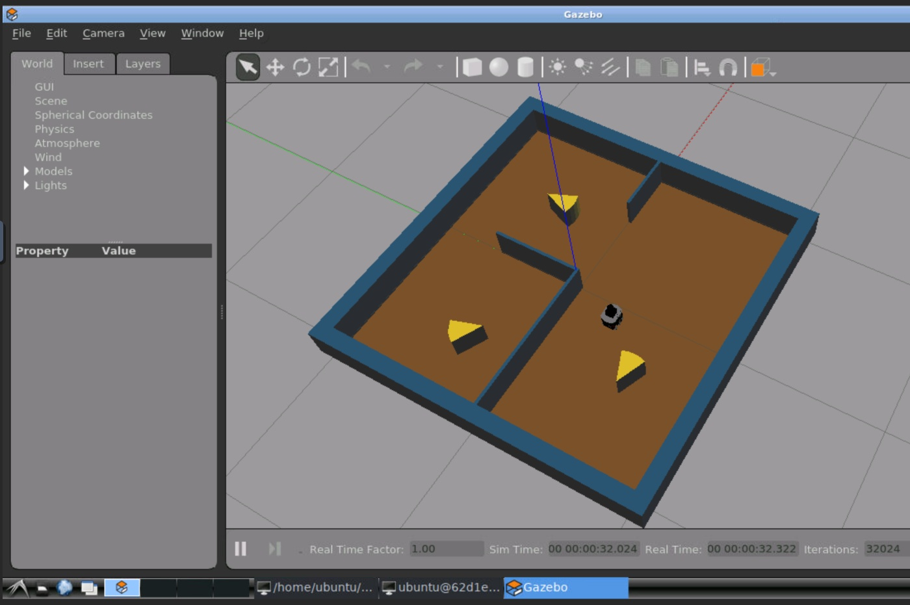

# Unity Official

## Unity ゲーミングサービスのご紹介

[Unity ゲーミングサービスのご紹介 | Unity Blog](https://blog.unity.com/ja/games/introducing-unity-gaming-services)

クロスプラットフォームのマルチプレイヤーゲーム [Unityゲームサービス](https://unity.com/ja/solutions/gaming-services) のベータ版がリリースされました。

RelayとLobbyというサービスをオープンベータとして利用できます。

[Relay](https://unity.com/ja/products/relay) はホストプレイヤーが立てたサービス経由でプレイヤー同士をつなぐことでマルチプレイヤーゲームを実現するソリューションで、[Lobby](https://unity.com/ja/products/lobby) はカスタムのプライベート・プライベートルームにより複数プレイヤーがともにプレイできる環境を実現するソリューションのようです。

どちらのサービスもUnity NetcodeおよびTransportに対応しているため、エディタから直接ゲームを、簡単にオンライン対応することができます。

## ハイパーカジュアルゲームナイト - New Story Inc. データドリブン開発の失敗と成功 - Unityステーション

[ハイパーカジュアルゲームナイト - New Story Inc. データドリブン開発の失敗と成功 - Unityステーション - YouTube](https://www.youtube.com/watch?v=i4Z5FxfXlzw)

この動画ではNew Story社が創業から約500日間で、ハイパーカジュアルゲームを成長させるために取り組んできたデータドリブンな考え方についての紹介と、それをもとにした開発プロセスや改善事例について紹介しています。

ゲーム未経験から自社パブリッシュするためにどのような施策を実施したか（約３ヶ月で６０ゲームをとにかく作る）、お金のやりくり、
開発プロセスとして実際に導入しているOODAループをより早く回すための施策としてより詳細な情報を取得するために計測SDKを導入（みる）、取得した情報をBIツールに落とし込んで適切なかたちでビジュアライズすること（わかる）、解くべき課題が決まったところから具体的な打ち手を決めるプロセスの紹介（決める）、実際に高速に打ち手を実装する際に、より高速に実装するために分業可能にする、または開発しないための工夫を紹介しています。

またハイパーカジュアルゲームとしてより多くのユーザーを獲得するためのAndroidの低スペック端末をサポートする重要性と、Application Not Responding（ANR）の改善についても解説しています。

## Sycoforge の『Return to Nangrim』が、Unity と Plastic SCM を使ったゲーム開発を民主化する

[Sycoforge の『Return to Nangrim』が、Unity と Plastic SCM を使ったゲーム開発を民主化する | Unity Blog](https://blog.unity.com/ja/games/return-to-nangrim-blog)

この記事では、Sycoforge 社が「Return to Nangrim」の開発で利用したコラボレーションにおいて導入した Plastic SCM についてのインタビューしています。

Sycoforge社では、VCSにはBitbucketを利用していましたが、Unityに近いという理由で Unity Teamsに切り替え、さらにプロジェクトが大きくなったタイミングでPlastic SCMに切り替えたとのことです。

プラグラマーだけでなくアーティストでも使いやすいツールを探すのに苦労していたSycoforge社は、Plastic SCMを見つけたときはゲームチェンジャーに感じたそうで、プログラマーにもノンプログラマーにも使いやすいツールのようです。

# Articles

## Interactive Volumetric Fog With Fluid Dynamics and Arbitrary Boundaries

[Interactive Volumetric Fog With Fluid Dynamics and Arbitrary Boundaries | by Shahriar Shahrabi | Oct, 2021 | Medium](https://shahriyarshahrabi.medium.com/interactive-volumetric-fog-with-fluid-dynamics-and-arbitrary-boundaries-f82fdee86397)

任意の境界線を考慮したリアルタイムなインタラクティブなフォグを流体シミュレーションベースで作成する方法を紹介しています。

この記事では流体シミュレーションの詳細には触れずに、フォグのレンダリング方法および、障害物情報をもとにデプスマップを作成し、そこからオブスタクルマスクを作成して任意の境界線情報として、その情報をもとにフォグの描画する方法を解説しています。

フォグ描画は、流体シミュレーションにより算出された透明な平面をコンピュートシェーダによって生成しています。

境界線は、地形のなかで障害物としてタグ付されたものから障害物のハイトマップを生成し、そのマップの高さからオブスタクルマスクを生成しています。

また、Terrainなどで発生するOver Hangs問題と、SDFやShadow VolumeであるようなCount Up Count Down Methodによる解決方法についても触れています。

## Creating a Foliage Shader in Unity URP Shader Graph

[Creating a Foliage Shader in Unity URP Shader Graph | by NedMakesGames | Oct, 2021 | Medium](https://nedmakesgames.medium.com/creating-a-foliage-shader-in-unity-urp-shader-graph-5854bf8dc4c2)

この記事では、Shader GraphとUniversal Render Pipeline（URP）を用いて、シェーダーで葉っぱのライティングや風による外力の実装を紹介しています。

プロジェクトのセットアップから、両面を描画するためのTwo Sidedオプションの設定と後ろ面を描くための法線ベクトルの反転をShader Graphのサブグラフで実装するためのノードのセットアップ、葉っぱの半透明による照明の影響を近似するためにシェイプ法線（"Shape" normals）によるライティングを行うために追加の法線を持つ方法と、DiffuseとSpecularの計算でシェイプ法線とメッシュ法線（モデルがもつ通常の法線）を使い分ける実装の紹介、葉っぱから光が透き通ってみえるような半透明の実装に、シンプルなsubsurface scattering lightingアルゴリズムを用いる方法について、それぞれ画像・動画付きで解説しています。

## Low Power mode in Unity

[Low Power mode in Unity – Bronson Zgeb](https://bronsonzgeb.com/index.php/2021/10/16/low-power-mode-in-unity/)

この記事では、Unityアプリの電力消費を抑える方法について紹介しています。

モバイルアプリにおいてなぜ電力消費を抑えることが重要なのか、一般的にゲーム（エンジン）がなぜ電力を消費するかについて触れ、
電力消費に影響するUnityのAPIや設定として「Target Frame Rate」と「On-Demand Rendering」、「VSync」についてそれぞれの機能と設定方法を紹介しています。

また、低電力化ために `Physics.autoSimulation` や `MonoBehaviour.Update` の実行タイミングと無効化、 `OnDemandRendering.willCurrentFrameRender` によるオンデマンドレンダリングのデバッグにも触れています。

## How to make AI sentient in Unity, Part I

[How to make AI sentient in Unity, Part I](https://blog.gamedev.tv/how-to-make-ai-sentient-in-unity/)

NPCのようなAI対して感性を実装する方法について紹介する記事です。

本記事では、目や耳のような感性を実装するためのベースとなる `Sense` クラスの設計と、 `Sense` クラスを継承して目や耳のクラスを実装する方法について解説しています。

次回のパートでは、ステートパターンを用いてリアクティブな動作を実装する方法を紹介する予定とのことです。

## UnityとROSで学ぶ移動ロボット入門をLinux/Windowsで動かす

[UnityとROSで学ぶ移動ロボット入門をLinux/Windowsで動かす](https://zenn.dev/karaage0703/articles/2de654a413049e)

この記事では、[Unity社とアールティ社が共同で開発したUnityとROSを組み合わせたロボット入門者向け教材](https://rt-net.jp/notice/20210909/) である [unity3d-jp/Unity-ROS-MobileRObot-UI-Tutorial](https://github.com/unity3d-jp/Unity-ROS-MobileRObot-UI-Tutorial) をLinux/Windows環境で実行する方法を紹介しています。

公式のチュートリアルではROS Networkの構築部分Windowsとその上にインストールしたDocker上に構築していますが、LinuxでUnityおよびDockerをセットアップして、チュートリアルを動作する方法について解説しています。
