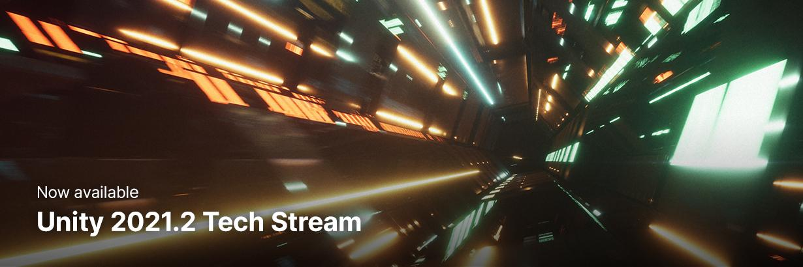
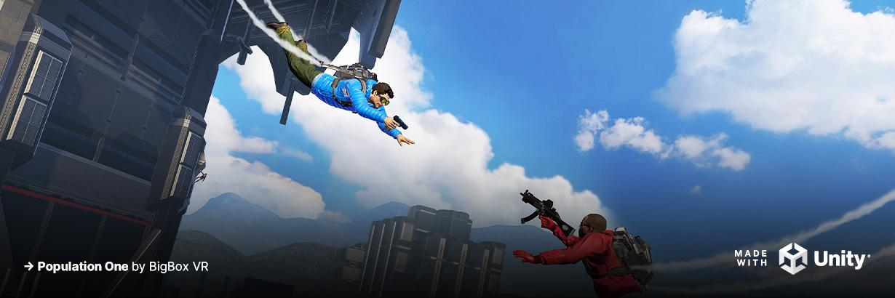
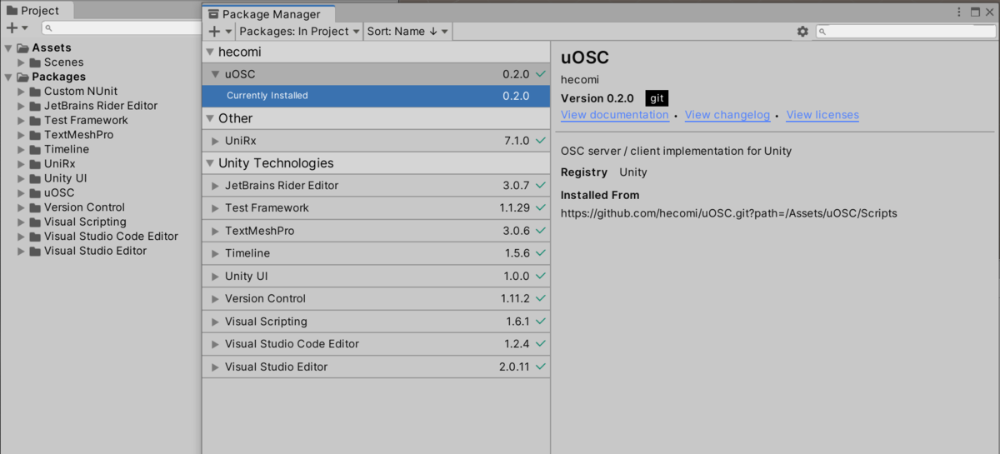
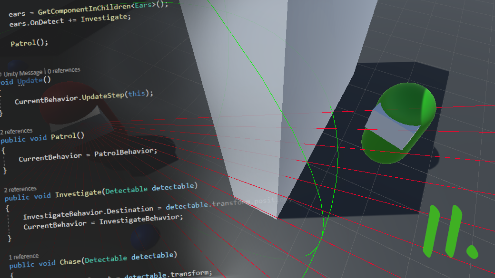
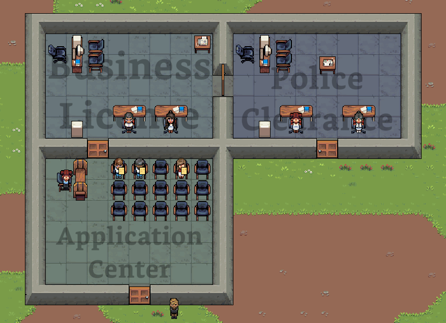
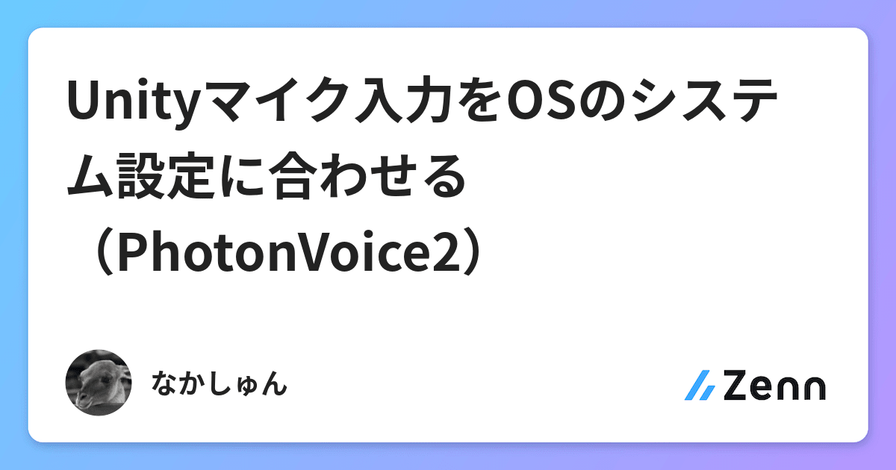

# Unity Official

## Unity 2021.2 TECH ストリームリリースが公開されました

[Unity 2021.2 TECH ストリームリリースが公開されました | Unity Blog](https://blog.unity.com/ja/technology/the-new-unity-20212-tech-stream-release-is-now-available)

2021/10/26に、7月にベータ版がリリースされていた Unity 2021.2 が TECH ストリームがリリースされました。このリリースでは、「品質の改善」・「生産性の改善」・「パフォーマンスの改善」にフォーカスしていているとのことです。

品質の改善として、Universal Render Pipeline（URP）の大規模開発によるビルトインレンダーパイプラインとの機能互換の実現に向けた１歩や、MonoとC#のアップグレードによりC# 9がサポートされました。

生産性の改善では、ビルドの待ち時間短縮、EditとPlayモード間の高速化、ショートカット改善などがあげられています。また、Package Managerに Feature Sets という機能が追加されました。これは複数のパッケージを特定の目的のためにセットで、セットをインストールすることでまとめてパッケージがインストールできます。

パフォーマンスの改善ではワークフローやテスト実行、Unityパフォーマンス改善など様々な改善が行われたようです。URPのDefferedレンダリングサポートやUI Toolkitのランタイム対応、Visual Effect GraphがURPサポートによるAndroidやiOS、ARCoreやARKit対応デバイスでURPのLitパーティクルのレンダリング対応、Unity WebGLのビルド短縮および出力WebAssemblyの軽量化など、多くの側面での改善が行われたようです。

また、[Apple シリコン用エディタ](https://blog.unity.com/ja/technology/unity-coming-to-apple-silicon)およびmacOS開発フローのM1ネイティブ対応もこのバージョンからとなります。

## HDRP の設定に詳しくなってパフォーマンスを上げよう

[HDRP の設定に詳しくなってパフォーマンスを上げよう | Unity Blog](https://blog.unity.com/ja/technology/get-acquainted-with-hdrp-settings-for-enhanced-performance)

Unity 2020 LTS 以降に対応した [HDRP バージョン 10](https://docs.unity3d.com/Packages/com.unity.render-pipelines.high-definition@10.4/manual/whats-new-10.html) の機能や設定などの紹介しています。

HDRP UXとしてHDRP の グローバル設定とHD Render  Pipelineアセットを品質設定ごとの上書くことができることを解説しています。設定カメラとフレーム設定、Volumeシステム、メッシュやサーフェイス、イルミネーションの設定と、これらが [Render Pipeline Debug ビュー](https://docs.unity3d.com/Packages/com.unity.render-pipelines.high-definition@11.0/manual/Render-Pipeline-Debug-Window.html)で視覚化された情報を確認できることを紹介しています。

HDRP設定の最適化事例として、サンプルシーンを実機プロファイリングと[Nsignt Graphics](https://developer.nvidia.com/nsight-graphics)を利用してGPU処理に不要なパスがオンになっていることを確認と、不要なパスをアセット設定で省くことでパフォーマンスを向上させる例も紹介しています。

HDRPは年内に技術的な完全版のガイドを公開する予定とのことです。

## 最適化の最前線から：Unity 2020 LTS でのマネージコードストリッピングの強化

[最適化の最前線から：Unity 2020 LTS でのマネージコードストリッピングの強化 | Unity Blog](https://blog.unity.com/ja/technology/tales-from-the-optimization-trenches-better-managed-code-stripping-with-unity-2020-lts)

Unity 2020 LTSで導入された[マネージコードストリッピング](https://docs.unity3d.com/ja/current/Manual/ManagedCodeStripping.html)の強化について紹介しています。

マネージコードストリッピングは、アプリ最適化として不要なコードを削減することでバイナリサイズを削減するビルドステップです。この最適化はレベルを上げるほど積極的に不要なコードを削減しますが、特にZenjectのようなDIライブラリやNewtonsoft.Jsonのようなシリアライゼーションライブラリなどのリフレクションを用いたケースでは必要なコードまで削除されるケースがあります。そのため今までは link.xmlの生成や 必要なクラスすべてに `Preserve` 属性を設定することでこの問題を解決してきました。

Unity 2020 LTSで導入された新機能としてマネージコードストリッピングのための属性が追加されました。この記事では一部の属性が紹介されています。

- `RequireAttributeUsagesAttribute` : カスタム属性に対してこの属性をつけると、ストリップ対象外としてマークする
- `RequireDeriverdAttribute` : マークした型のすべての派生型もストリップ対象外としてマークする
- `RequiredInterfaceAttribute` : マークした型のすべてのインターフェイス実装がストリップ対象外としてマークされる
- `RequiredMemberAttribute` : マークしたメンバーをすべてストリップ対象外としてマークする。しかしクラス自体が利用されない状況ではストリップの対象となる。
- `RequireImplementorsAttribute` : インターフェイス型にマークすると指定されたすべてのインターフェイス実装がストリップ対象外としてマークされる。しかし、実装されたクラスそのものを利用していない場合は、ストリップの対象となる。

また、 2020.1 と 2020.2ではツールにAPI更新が実施され、Mono ILリンカーと同等の性能が実装され、いくつかのシンプルな[リフレクションパターン](https://github.com/Unity-Technologies/linker/tree/unity-2020.3/test/Mono.Linker.Tests.Cases/Reflection) については検出が可能になったとのことです。

## スタイルの整ったメタバースを構築する

[スタイルの整ったメタバースを構築する | Unity Blog](https://blog.unity.com/ja/technology/building-the-metaverse-with-style)

ArtEngineでは、Style TransferによるAIアシストが利用できます。

Style Transferはコンテンツ画像（例えばテクスチャ画像）と目標としたいスタイル画像をともに入力として与えることで、そのスタイルをコンテンツ画像に対してブレンドした、新しいコンテンツ画像を生成します。

ArtEngineには独自で開発した [Optimal Textures（PDF）](https://arxiv.org/pdf/2010.14702.pdf)と呼ばれるStyle Transferの手法が搭載されていて、他手法と比べて「最終結果の質」・「速度とメモリ要件」・「与えられたランダムなスタイルに対応する能力」の３カテゴリすべてのスコアが高いとのことです。

## Unity 2020.1.0 Alpha 13

[What's new in Unity 2022.1.0 Alpha 13 - Unity](https://unity3d.com/unity/alpha/2022.1.0a13)

# Articles

## Unity で .unitypackage で配布していたアセットを Package Manager 対応してみた

[Unity で .unitypackage で配布していたアセットを Package Manager 対応してみた - 凹みTips](https://tips.hecomi.com/entry/2021/10/29/001304)

.unitypackageで配布されていたアセットをPackage Managerで公開するための対応方法を紹介しています。

UPMの基本やパッケージのソース（埋め込み・ローカル・Git・ビルトインなど）の紹介とUPM対応するためのディレクトリ構造と `package.json` の記述方法、配布方法について説明しています。

また、パッケージ開発のための開発レポジトリのディレクトリ構造のパターンやGithub Actionsを用いてパッケージ配布を自動化する方法やパッケージ配布アクションの Composite Actions化などについても触れています。

## Stencil Portal in Unity — VFX Breakdown

[Stencil Portal in Unity — VFX Breakdown | by Shahriar Shahrabi | Oct, 2021 | Medium](https://shahriyarshahrabi.medium.com/stencil-portal-in-unity-vfx-breakdown-3dd76b60ad07)

Stencil PortalというVFXについて、Stencil Portalの設定とレンダリング順序の処理、ゴーストのアニメーション、視線を向ける猫のベイクされたアニメーションと手続き型アニメーションのブレンド、ボリュームフォグと照明・炎などを取り上げています。

鏡の中に映る別世界はステンシルバッファを利用、ゴーストのアニメーションは3Dシンプレックスノイズに基づいてベイクモーションなしで変形、ロウソクの炎はsin波とノイズをベースに変形、猫の視線追従はIKは用いずLookAtのターゲットに対して[こちら](https://shahriyarshahrabi.medium.com/look-at-transformation-matrix-in-vertex-shader-81dab5f4fc4)の変換行列を頂点シェーダーでかけることでモデルをターゲットの方向に回転させる、ボリュームフォグは[以前Unity Weeklyで取り上げた方法](https://blog.yucchiy.com/project/unity-weekly/036/#interactive-volumetric-fog-with-fluid-dynamics-and-arbitrary-boundaries)を用いて実装しているようです。

## UnityIAPを利用した課金シーケンスの解説

[UnityIAPを利用した課金シーケンスの解説 - WonderPlanet Developers’ Blog](https://developers.wonderpla.net/entry/2021/10/14/151132)

Unity のアプリ内課金パッケージである UnityIAPの課金シーケンスについて解説しています。

「ストア初期化・課金処理実行フェーズ」と「レシート検証・商品付与フェーズ」のパッケージ中のオブジェクトとそのメソッドやコールバックの呼び出される処理フローを、シーケンス図を用いて説明しています。

## UnityのInputSystemからQuest2のデバイスの取り扱い方を考える

[UnityのInputSystemからQuest2のデバイスの取り扱い方を考える - Synamon’s Engineer blog](https://synamon.hatenablog.com/entry/2021/10/25/190000)

Unityの新しいInputSystemでOculus Quest2のデバイスを取り扱うための方法を解説しています。

まず、XRデバイスの扱い方の経緯として、Oculus Quest2やSteamVR、Varjo XR-3などのXRデバイスでアプリケーションを動作させるためのサポートアプリケーションやソフトウェアライブラリ（[Oculus Integration](https://assetstore.unity.com/packages/tools/integration/oculus-integration-82022)や[SteamVR Plugin](https://assetstore.unity.com/packages/tools/integration/steamvr-plugin-32647) など）の存在と、XRの標準規格であるOpenXRとそれをUnityで扱うための [XR Plugin Management](https://docs.unity3d.com/ja/2019.4/Manual/com.unity.xr.management.html) パッケージの紹介について説明しています。

Unityの新しいInputSystemとXR Plugin Managementを連携してOculus Quest 2からHMDデバイスからデバイス検出やポジショントラッキングのための情報を受けとったり、それらの情報をもとにヘッドトラッキングを行う方法について紹介しています。

また、XR Plugin ManagementプラグインがInputSystemのLayoutsやInputControlの設計に従って実装されているため、これらの連携がしやすい点についても解説しています。

## Unity Cloud Content Deliveryでサウンドデータを追加ダウンロード対応する with ADX

[Unity Cloud Content Deliveryでサウンドデータを追加ダウンロード対応する with ADX - Qiita](https://qiita.com/Takaaki_Ichijo/items/39b10bd1f17ead7c4c99)

Unity Cloud Content Delivery（CCD）を用いて、ADXで利用するデータを追加ダウンロードして再生する方法について解説しています。

Unity CCDはUnity上からアップロードしたデータに対してユニークなURLが割り振られるため、 Addressablesに対応していなくても、データを[UnityWebRequest](https://docs.unity3d.com/ScriptReference/Networking.UnityWebRequest.html)などのHTTPクライアント経由でダウンロードできます。

この記事では、CCDを用いてADXでオーサリングしたサウンドデータ（.acb）をCCDへアップロードする方法から、アップロードしたデータをUnityWebRequestでダウンロードする方法、落としたデータを再生する方法についてそれぞれ説明しています。

また、記事中ではダウンロードデータを `Application.persistentDataPath` 下に保存していますが、iOSではデフォルトでiCloudのバックアップ対象になるため、バックアップ対象から外す方法についても触れています。

## .unitypackage を任意のフォルダに展開できる「UnitypackageExtractor.cs」紹介

[【Unity】.unitypackage を任意のフォルダに展開できる「UnitypackageExtractor.cs」紹介 - コガネブログ](https://baba-s.hatenablog.com/entry/2021/10/27/090000)

.unitypackageを任意フォルダに展開できる「UnitypackageExtractor.cs」について紹介しています。

[Extract a .unitypackage to any directory (even outside the project folder) from within Unity](https://gist.github.com/yasirkula/dfc43134fbfefb820d0adbc5d7c25fb3)

Unity標準のパッケージインポーターでは、展開先がパッケージ作成時の配置パスに固定されますが、このエディタ拡張を用いると展開先のディレクトリを指定できるようになります。

## Unity ARCore開発における実機デバッグことはじめ

[Unity ARCore開発における実機デバッグことはじめ](https://zenn.dev/drumath2237/articles/4dfcf4117cb9d6)

UnityのARFoundationを用いて開発したAndroidのARCoreアプリを実機デバッグする方法について解説しています。

ARFoundationを用いたARCoreアプリの実機ビルド方法から、アプリをネットワーク越しにadb接続する方法、 `Development Build` かつ `ScriptDebugging` を設定した状態で、実機に入ったアプリをRiderなどのIDEを用いてリモートデバッグする方法についてそれぞれスクリーンショットつきで説明しています。

また、Android Logcatパッケージによる実機ログのUnity上で確認する方法や、Unity標準のProfilerを用いた実機プロファイリングについても触れています。

## Unity2021.2で使えるC#9の機能

[Unity2021.2で使えるC#9の機能 - Synamon’s Engineer blog](https://synamon.hatenablog.com/entry/csharp-9-features-on-unity-2021-2)

Unity 2021.2 TECH Streamリリースで利用できるようになった C#9の機能の一部を紹介しています。

強化されたパターンマッチングやtarget-typed new（推論可能な場合に `new` 以下の型を省略する記法）、target-typed条件演算子（3項演算子での型推論）、ラムダ式での引数破棄、静的匿名関数（ラムダ式が外の変数を使わないことを明示）、ローカル関数の属性、関数ポインタなどについて取り上げています。

また、C#9の機能のうち、Unityでは [未サポート](https://docs.unity3d.com/2021.2/Documentation/Manual/CSharpCompiler.html) の機能についても触れています。

## How to make AI sentient in Unity, Part II

[How to make AI sentient in Unity, Part II](https://blog.gamedev.tv/how-to-make-ai-sentient-in-unity-part-ii/)

[前回の記事](https://blog.yucchiy.com/project/unity-weekly/036/#how-to-make-ai-sentient-in-unity-part-i)ではAIの目や耳のような感性を実装する方法について紹介しましたが、今回はAIの挙動として、指定されたポイント間をパトロールし、プレイヤーを見つけたとき追いかけ、プレイヤーの立てた音が聞こえたら調査を行うAIを実装します。

AIの挙動にはStateパターンとObserverパターンを利用しています。具体的にはAIの挙動を `AIBehaviour` を基底として持つクラスとして実装し、感性センサーや挙動からのイベントによって現在の `AIBehaviour` を切り替えています。

## Some DOTS Utilities: NativeCounter and NativeSum

[Some DOTS Utilities: NativeCounter and NativeSum – COFFEE BRAIN GAMES](https://coffeebraingames.wordpress.com/2021/10/24/some-dots-utilities-nativecounter-and-nativesum/)

[City Hall Simulator](https://twitter.com/CityHallGame)という都市シミュレーションゲームでは、Pure ECSで実装を行うことでシミュレーションをジョブによって並列に実行しているとのことです。

同ゲーム中で利用されている NativeContainerのユーティリティである `NativeCounter` および `NativeSum` について、その実装を解説しています。

## Unity Cloud Save β を用いてプレイヤーデータをクラウドサーバ上で保存・読込・削除する【Unity Gaming Services】

[Unity Cloud Save β を用いてプレイヤーデータをクラウドサーバ上で保存・読込・削除する【Unity Gaming Services】 - デニッキ！](https://xrdnk.hateblo.jp/entry/2021/10/27/215505)

先日リリースされたUnity Gaming Servicesのベータ機能であるUnity Cloud Saveを用いてプレイヤーのデータをクラウド上に保存し、読み込む方法を紹介しています。

利用するために必要なパッケージのインストール方法からDashboard設定、Unity Authenticationでの認証、実際の保存と読み込み処理についてコード付きで解説しています。

また、Dashboard経由でプレイヤーID単位でデータを確認する方法や、保存可能なデータフォーマットと読み込み時での処理の違い、発生する例外の一覧などについても触れています。

## 【Unity】複数解像度で Game ウィンドウをキャプチャできる「MultiScreenshotCapture.cs」紹介

[【Unity】複数解像度で Game ウィンドウをキャプチャできる「MultiScreenshotCapture.cs」紹介 - コガネブログ](https://baba-s.hatenablog.com/entry/2021/10/29/090000)

複数解像度でGameウインドウをキャプチャする「MultiScreenshotCapture.cs」について紹介しています。

[Capture multiple screenshots with different resolutions simultaneously in Unity 3D](https://gist.github.com/yasirkula/fba5c7b5280aa90cdb66a68c4005b52d)

このエディタ拡張を用いると、事前に定義した解像度一覧で、Gameウインドウをキャプチャしてスクリーンショットとして指定フォルダに保存できます。

## 自然な目の動きやまばたきを実装 Realistic Eye Movements【Unity】【アセット】

[自然な目の動きやまばたきを実装 Realistic Eye Movements【Unity】【アセット】 - (:3[kanのメモ帳]](https://kan-kikuchi.hatenablog.com/entry/Realistic_Eye_Movements?utm_source=feed)

自然な目の制御（動きやまばたきなど）を行えるアセット [Realistic Eye Movements](https://assetstore.unity.com/packages/tools/animation/realistic-eye-movements-29168?aid=1101lGoY) について紹介しています。（11/1 15:59までの [Mega Bundle](https://assetstore.unity.com/mega-bundles/fill-your-toolbox?aid=1101lGo) の対象！）

ブレンドシェイプで目の動きが操作できるモデルに対して、視線の追従とまばたきを実装するための設定方法とスクリプトからの操作について解説しています。

## uGUI Textの文字の座標を取得してインライン画像を実現する

[uGUI Textの文字の座標を取得してインライン画像を実現する - おもちゃラボ](https://nn-hokuson.hatenablog.com/entry/2021/10/29/102151)

uGUI Textでインライン画像（特定文字を画像に置き換え）を実現する方法について紹介しています。

uGUIのTextから特定文字の座標を取得するための `cachedTextGenerator` プロパティとそのプロパティの頂点情報の内訳の解説と、位置情報に画像を配置する方法について説明しています。

## Unity Relay β でリレーサーバを建てて入室する【Unity Gaming Services】

[Unity Relay β でリレーサーバを建てて入室する【Unity Gaming Services】 - デニッキ！](https://xrdnk.hateblo.jp/entry/2021/10/30/175456)

先日リリースされたUnity Gaming Servicesのベータ機能であるRelayを用いてホストプレイヤーが中継サーバーを立てて、そのサーバーに対してリモートプレイヤーを接続させる方法を紹介しています。

Relayサービスにおける処理の流れの解説から、利用するために必要なパッケージのインストール方法と設定方法、リレーサーバー作成の方法（リージョンの取得からアロケーションの作成まで）から入室コードの作成、実際の入室処理についてコード付きで解説しています。

また、リレーサーバーのライフサイクルからベータ版の制約についても触れています。

## 【Unity】BioIKの使い方を調べてみた

[【Unity】BioIKの使い方を調べてみた - Qiita](https://qiita.com/kazuki_kuriyama/items/6d79ccf846522fa96d95)

UnityでIKを実装するためのアセットである[BioIK](https://assetstore.unity.com/packages/tools/animation/bio-ik-67819)の紹介と、モデルに対してのBioIKのセットアップ、実際に右腕をターゲット位置に移動させる方法について紹介しています。

## Unityマイク入力をOSのシステム設定に合わせる（PhotonVoice2）

[Unityマイク入力をOSのシステム設定に合わせる（PhotonVoice2）](https://zenn.dev/nakashun/articles/f3516014bd620c)

マイクの抜き差しやOSの設定でマイクの切り替えを行った場合に、Unity側でその変更を動的に検知して、適応する方法について紹介しています。

記事中では、PhotonVoice2のマイク入力設定を、マイク設定の変更に追従する方法を説明しています。
